# 📉 Flow Charts

### 회원가입
```mermaid
graph LR
    ENTER[회원가입] --> START{회원가입 버튼 클릭}
    START --> |Yes| INPUT_ID[아이디 입력]
    
    subgraph 아이디 중복 검사
        direction LR
        INPUT_ID --> CHECK_ID{아이디 중복여부}
        CHECK_ID --> |Non-pass| INPUT_ID
    end
    
    subgraph 닉네임 중복 검사
        direction LR
        CHECK_ID --> |Pass| INPUT_NICKNAME[닉네임 입력]
        INPUT_NICKNAME --> CHECK_NICKNAME{닉네임 중복여부}
        CHECK_NICKNAME --> |Non-pass| INPUT_NICKNAME
    end
    
    CHECK_NICKNAME --> |Pass| INSERT_ETC[기타 정보 입력]
    INSERT_ETC --> |회원가입 요청| CHECK_ETC{회원가입 데이터 유효성 검사}
    CHECK_ETC --> |Incomplete| INSERT_ETC;
    CHECK_ETC --> |Complete| END[회원가입 완료]
    
```

### TODO 생성

```mermaid
flowchart LR
    ENTER[TODO 생성] --> START{TODO 생성 버튼 클릭}
    START --> |Yes| INPUT_TODO[TODO 데이터 입력]
    INPUT_TODO --> CHECK_TODO{유효성 검사}
    CHECK_TODO --> |Complete| END[생성]
    CHECK_TODO --> |Incomplete| INPUT_TODO;
    
```


### TODO 수정
```mermaid
flowchart LR
    
    ENTER[TODO 수정] --> START{TODO 수정 버튼 클릭}
    START --> |Yes| WRITE_TODO[컨텐츠 수정]
    
    subgraph 컨텐츠 수정
        direction LR
            WRITE_TODO --> WRITE_FINISH[작성 완료]
    end
    
    subgraph 상태 유효성 검사
        direction LR
            WRITE_FINISH --> STATUS_CHECK{상태 유효성 검사}
            STATUS_CHECK --> |Non-pass| WRITE_TODO
            STATUS_CHECK --> |Pass| STATUS_CLEAR[상태 검사 완료]
    end
    
    subgraph 시간 유효성 검사
        direction LR
            WRITE_FINISH --> TIME_CHECK{시간 유효성 검사}
            TIME_CHECK --> |Non-pass| WRITE_TODO
            TIME_CHECK --> |Pass| TIME_CLEAR[시간 검사 완료]
    end
    
    subgraph 완료 
        direction TB
            STATUS_CLEAR --> CLEAR
            TIME_CLEAR --> CLEAR
            CLEAR --> 수정
    end
    
```
