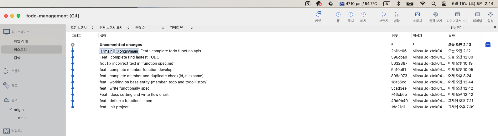

>
# 원래 사용하던 github 계정의 2FA 보조인증키가 맥북 발열로 인해 부팅이 안되던 탓에 초기화하면서 사라져 새로 만든 임시 레포지토리로 공유드립니다.

### ✔️ Checklist

> ⭕️ : 완료
> 
>🔺 : 보완 필요
> 
> ❌ : 미수행

> 
##### **Required**

| 완수 여부 | 내용       | 설명 |
|:-----:|:---------|:---|
|  ⭕️   | 기능 명세 추출 |    |
|  ⭕️   | 스키마 설계   |    |
|  ⭕️   | 기술스텍 설정  |    |
|  ⭕️   | 아키텍처 구성  |    |
|  ⭕️   | 기능 개발    |    |

##### **Optional**

| 완수 여부 | 내용                                          | 설명       |
|:-----:|:--------------------------------------------|:---------|
|  ⭕️   | 간단한 설계문서                                    |          |
|  ⭕️   | ㄴ                                           | API Docs |
|       | ㄴ                                           | 코드 구조    |
|  ⭕️   | ㄴ                                           | 서비스 흐름도  |
|       | ㄴ                                           | 추가 고려 사항 |
|       | (서버를 구성했다면) 해당 서버 사용 방법                     |          |
|       | 주요 서비스 흐름에 따른 로깅                            |          |
|       | 단위 테스트                                      |          |
|       | 확장 가능한 코드 구성 또는 서버 아키텍처 구성 (간단한 설계문서 제출 필요) |          |
|       | TODO List 서비스를 사용할 수 있는 간단한 View 생성         |          |

 

