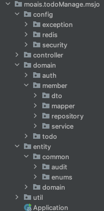

# 코드 구성

> 

>

- config : 설정 파일을 저장하는 패키지
  - exception : custom exception, exceptionHandler 관리하는 패키지
  - redis : 토큰 생명주기 관리를 위한 embedded regis 패키지 (mac os sonoma 의 보안 정책 변경으로 인해 사용 못했음)
  - security : 보안설정, jwt 관련 클래스 패키지
- controller : 도메인 별 endpoint 를 저장하는 패키지
- domain : domain 별 필요한 클래스들을 저장하는 패키지
  - dto : request, response 용 dto 를 저장하는 패키지
  - mapper : entity -> mapper 를 변환하는 mapper 클래스 저장 패키지
  - repository : dao 를 관리하는 패키지
  - service : service layer 를 관리하는 패키지
- entity : db schema 와 연결짓기 위한 entity 클래스들을 관리하는 패키지
- util : Util class 들을 저장하는 패키지

>